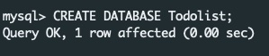
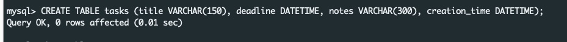
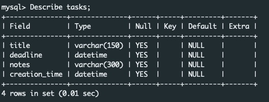

# ToDoList

- Fronted (View) is build using HMTL5, bootstrap (CCS & JS), Jquery.
- Backend (Model) is built using PHP, and Jquery/JavaScript invokes the Model, as a controller.

> :exclamation: **AZURE API deployment is WIP**: Having issues creating a VM.

## WEBAPI
- ### api/insert.php
    - Inserts a task into database.
    - Method : POST
    - Required params : `task-title`, `task-deadline`
    - Optional params : `task-notes`

- ### api/read.php
    - Returns all the existing tasks in JSON format.
    - Method : GET
    
- ### api/update.php
    - Updates a task in the database. (Do a update followed by read, as creation_time is primary key )
    - Method : POST
    - Required params : `task-title`, `task-deadline`, `task-creation`
    - Optional params : `task-notes`

- ### api/delete.php
    - Delets a task from database.
    - Method : POST
    - Required params : `task-creation`

## Database and tables
- DB creation
     
- Table creation
     
- Table Descpription
     